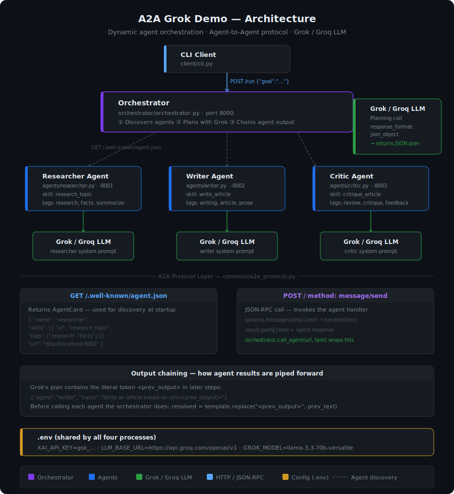

# A2A Grok Demo — Dynamic Agent Orchestration


A complete, runnable **Agent-to-Agent (A2A)** demo — three specialised AI agents that discover each other dynamically, with each agent's output piped into the next. Uses **Grok / Groq** as the LLM backend via an OpenAI-compatible API.

Built with plain FastAPI + httpx. Follows the A2A protocol shape (`/.well-known/agent.json` discovery + JSON-RPC `message/send`) without depending on the official SDK, so there are no version-skew or parameter-mismatch errors.

---

## Architecture



---

## What this demonstrates

| Concept | How it's shown |
|---|---|
| **A2A discovery** | Orchestrator fetches `/.well-known/agent.json` from each agent at startup |
| **Dynamic planning** | Grok decides which agents to invoke and in what order for each goal |
| **Output chaining** | Each agent's response is piped into the next via a `<prev_output>` token |
| **Agent specialisation** | Each agent has its own system prompt and declared skills |
| **LLM-agnostic** | Switch between xAI Grok and Groq Llama by changing two lines in `.env` |

---

## Project layout

```
a2a-grok-demo/
├── .env.example                   # Copy to .env and add your key
├── requirements.txt
├── architecture.svg               # Architecture diagram
├── common/
│   └── a2a_protocol.py            # A2A types, server factory, async client, Grok helper
├── agents/
│   ├── researcher.py              # Gathers facts      · port 8001
│   ├── writer.py                  # Writes articles    · port 8002
│   └── critic.py                  # Reviews articles   · port 8003
├── orchestrator/
│   └── orchestrator.py            # Discovers · plans · chains · port 8000
└── client/
    └── cli.py                     # Interactive CLI
```

---

## How it works

### 1 — Agent Card discovery

Every agent server exposes a standard A2A endpoint:

```
GET /.well-known/agent.json
```

which returns an **AgentCard** describing the agent's name, capabilities, and skills. The orchestrator fetches this for every URL in its `AGENT_REGISTRY` list at startup, with no hard-coded assumptions about what agents are available.

### 2 — LLM-based planning

The orchestrator sends the discovered agent catalog plus the user's goal to Grok. Grok returns a JSON execution plan:

```json
{"plan": [
  {"agent": "researcher", "input": "sourdough bread COVID popularity"},
  {"agent": "writer",     "input": "Write an article based on:\n\n<prev_output>"},
  {"agent": "critic",     "input": "Critique this article:\n\n<prev_output>"}
]}
```

Adding a new agent to `AGENT_REGISTRY` is the only change needed — the planner picks it up automatically.

### 3 — Output chaining

Before calling each agent the orchestrator resolves the `<prev_output>` token:

```python
resolved_input = step["input"].replace("<prev_output>", prev_output)
output = await call_agent(url, resolved_input)
prev_output = output   # passed to the next step
```

Each agent receives the previous agent's full response embedded in its input. No shared state, no message bus — just string substitution.

### 4 — A2A invocation

Each agent call is a JSON-RPC `message/send` request:

```
POST http://localhost:800X/
{
  "jsonrpc": "2.0",
  "method": "message/send",
  "params": { "message": { "parts": [{ "kind": "text", "text": "…" }] } }
}
```

---

## Setup

### Prerequisites

- Python 3.10+
- A **Groq** key (free at [console.groq.com](https://console.groq.com)) **or** an **xAI** key ([console.x.ai](https://console.x.ai))

> **Groq vs xAI:** These are different companies. Groq keys start with `gsk_`. xAI (Grok model) keys start with `xai-`. The code works with both — just set the right `LLM_BASE_URL` in `.env`.

### Install

```bash
git clone https://github.com/YOUR_USERNAME/a2a-grok-demo.git
cd a2a-grok-demo

python -m venv .venv
source .venv/bin/activate       # Windows: .venv\Scripts\activate

pip install -r requirements.txt
```

### Configure

```bash
cp .env.example .env
```

Edit `.env`:

**For Groq** (recommended if you have a `gsk_` key):
```env
XAI_API_KEY=gsk_yourGroqKeyHere
LLM_BASE_URL=https://api.groq.com/openai/v1
GROK_MODEL=llama-3.3-70b-versatile
```

**For xAI / Grok** (if you have an `xai-` key):
```env
XAI_API_KEY=xai-yourXaiKeyHere
GROK_MODEL=grok-4-fast
```

### Verify your key

```bash
python -c "
import os; from dotenv import load_dotenv; from openai import OpenAI
load_dotenv()
r = OpenAI(api_key=os.getenv('XAI_API_KEY'), base_url=os.getenv('LLM_BASE_URL','https://api.x.ai/v1')).chat.completions.create(
    model=os.getenv('GROK_MODEL'), messages=[{'role':'user','content':'Say hello in 5 words.'}])
print(r.choices[0].message.content)
"
```

---

## Run

Open **5 terminals**, all with the venv activated and in the project root. Start in this order — agents must be up before the orchestrator so discovery succeeds.

| Terminal | Command | What it does |
|---|---|---|
| 1 | `python agents/researcher.py` | Starts Researcher on :8001 |
| 2 | `python agents/writer.py` | Starts Writer on :8002 |
| 3 | `python agents/critic.py` | Starts Critic on :8003 |
| 4 | `python orchestrator/orchestrator.py` | Starts Orchestrator on :8000, discovers agents |
| 5 | `python client/cli.py` | Starts the interactive CLI |

The orchestrator terminal will print:
```
✓ researcher @ http://localhost:8001 — skills: ['research_topic']
✓ writer     @ http://localhost:8002 — skills: ['write_article']
✓ critic     @ http://localhost:8003 — skills: ['critique_article']
```

---

## Test prompts

Type any of these at the `goal>` prompt:

```
Give me a researched, written, and critiqued piece on why sourdough bread became popular during COVID.
```
```
Research the history of the Indian space program and produce a polished 200-word write-up with a critique.
```
```
Write a short article about how black holes form, then review it.
```
```
Just write me a short article about espresso — no research or critique needed.
```

The last prompt is interesting: because no research is needed, Grok's plan should contain only the writer step — demonstrating that the orchestrator is truly dynamic, not hard-coded to always call all three agents.

---

## Extending with a new agent

1. Copy any agent file, e.g. `cp agents/critic.py agents/translator.py`
2. Change the name, port, system prompt, and AgentCard skills
3. Add the URL to `AGENT_REGISTRY` in `orchestrator/orchestrator.py`
4. Start the new agent server

The planner will discover the new agent's skills and start using it for relevant goals automatically.

---

## API reference

### Orchestrator

| Endpoint | Method | Description |
|---|---|---|
| `/` | GET | Lists all discovered agents and their skills |
| `/agents` | GET | Returns full AgentCard JSON for each agent |
| `/run` | POST | Accepts `{"goal": "…"}`, returns plan + transcript + final output |

### Each agent

| Endpoint | Method | Description |
|---|---|---|
| `/.well-known/agent.json` | GET | Returns the agent's AgentCard |
| `/` | POST | JSON-RPC `message/send` — invokes the agent |

---

## Tech stack

| Layer | Technology |
|---|---|
| Agent servers | FastAPI + uvicorn |
| HTTP client | httpx (async) |
| LLM | OpenAI-compatible SDK → Groq / xAI |
| Data validation | Pydantic v2 |
| Config | python-dotenv |

---

## License

MIT